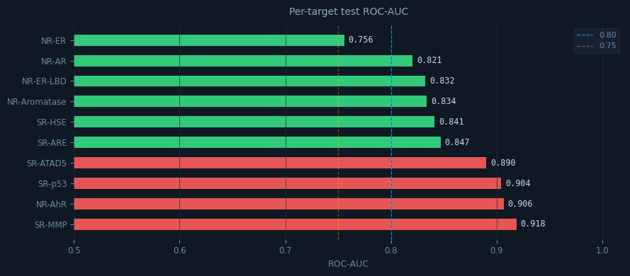
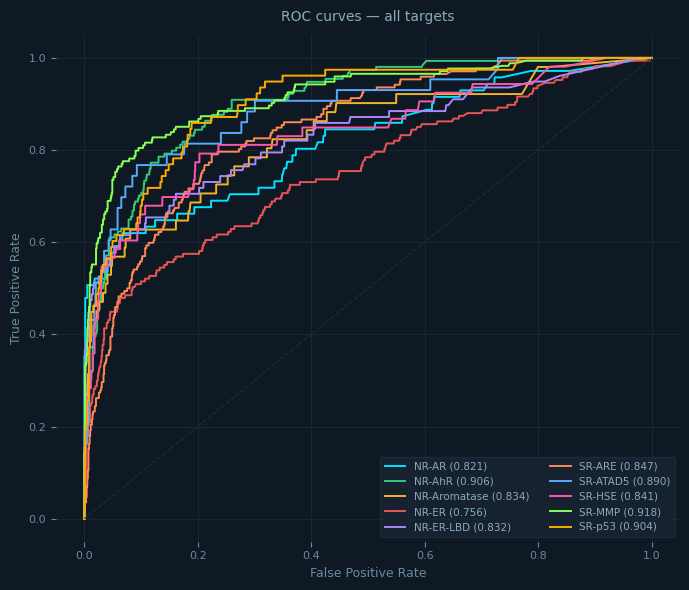

# ToxPredict — Drug Toxicity Prediction

ML pipeline that predicts molecular toxicity across **10 Tox21 assay targets** using a tuned XGBoost + LightGBM + ExtraTrees soft-voting ensemble, with a Gradio prediction interface and a standalone HTML/Flask web frontend.

---

## Results

> Training Results (Total time: ~121.5 min)

| Target | ROC-AUC | Imbalance | LGB Trees | XGB Trees |
|---|---|---|---|---|
| SR-MMP | 0.9185 | 5.3x | 1 | 0 |
| NR-AhR | 0.9065 | 7.5x | 1 | 0 |
| SR-p53 | 0.9043 | 14.6x | 1 | 0 |
| SR-ATAD5 | 0.8900 | 24.5x | 1 | 0 |
| SR-ARE | 0.8468 | 5.1x | 1 | 0 |
| SR-HSE | 0.8412 | 15.3x | 1 | 0 |
| NR-Aromatase | 0.8338 | 17.6x | 1 | 0 |
| NR-ER-LBD | 0.8323 | 19.5x | 1 | 0 |
| NR-AR | 0.8205 | 23.5x | 1 | 0 |
| NR-ER | 0.7557 | 6.9x | 1 | 0 |
| **Mean** | **0.8550** | | | |

### Evaluation Visualizations





---

## Approach

### Datasets
| Dataset | Role | Size |
|---|---|---|
| Tox21 | Primary — SMILES + 12 toxicity labels | 7,831 compounds |
| ZINC250k | Secondary — logP, QED, SAS features | 249,455 compounds |

Targets with fewer than 300 positives (`NR-AR-LBD`, `NR-PPAR-gamma`) were dropped — insufficient signal for reliable training.

### Feature Engineering

| Feature Block | Type | Size | Purpose |
|---|---|---|---|
| Morgan (ECFP4) | Fingerprint | 1,024 bits | Circular atom environments — best for bioactivity |
| MACCS keys | Fingerprint | 167 bits | Named structural alerts (nitro, halogen, epoxide…) |
| Avalon | Fingerprint | 512 bits | Industry-standard ADMET fingerprint |
| RDKit descriptors | Physicochemical | 217 features | MW, logP, TPSA, HBD/HBA, ring counts, etc. |
| ZINC properties | External | 3 features | logP, QED (drug-likeness), SAS (synthetic accessibility) |
| **Total raw** | | **1,923** | |
| **After VarianceThreshold(0.01)** | | **~1,700–1,900** | Dead bits and near-constant descriptors removed |

### Model

**Soft-voting ensemble (weights 2:2:1):**
- **LightGBM** — fast gradient boosting, strong on tabular data, supports early stopping
- **XGBoost** — complementary gradient boosting with per-target `scale_pos_weight`
- **ExtraTrees** — adds diversity through extreme feature randomness

**Hyperparameter tuning:**
- Optuna TPE sampler, 30 trials on `NR-AhR` (most positives → most reliable CV signal)
- LGB used as proxy during tuning — same hyperparameter landscape as XGB, 3× faster per trial
- Early stopping inside each CV fold (patience = 40 rounds) — 2.9× faster than fixed `n_estimators`
- Best params transferred to all 10 final models

**Imbalance handling:**
- BorderlineSMOTE applied per target before training — focuses synthetic samples on the decision boundary
- Falls back to standard SMOTE if neighbourhood too small
- Per-target `scale_pos_weight` for XGB — imbalance ranges from 5.2× (SR-ARE) to 25.8× (SR-ATAD5)

### Key Molecular Descriptors Driving Toxicity (SHAP analysis)

| Descriptor | Pharmacological meaning |
|---|---|
| TPSA | High polar surface area → membrane disruption |
| MolLogP | High lipophilicity → accumulation in cell membranes |
| NumAromaticRings | Planar ring systems intercalate DNA → genotoxicity |
| MolWt | >500 Da signals Lipinski violations → toxicity risk |
| NumHDonors / NumHAcceptors | Excess H-bond capacity → membrane permeability issues |
| MACCS key 160 (nitro group) | Known structural alert for genotoxicity |

---

## Project Structure

```
ml-toxicity-prediction/
│
├── app/
│   ├── index.html                  ← Standalone HTML frontend
│   └── server.py                   ← Flask API server
│
├── datasets/                       ← Source data for training
│   ├── tox21.csv
│   └── 250k_rndm_zinc_drugs_clean_3.csv
│
├── notebooks/
│   └── toxicity_prediction.ipynb    ← Training and modeling notebook
│
├── public/                         ← Assets for documentation
│   ├── ROC-AUC.png                 ← Eval bar chart
│   └── ROC.png                     ← ROC curves
│
├── saved_models/                   ← Pre-trained ensemble models
│   ├── ensemble_*.pkl
│   ├── variance_threshold.pkl
│   ├── feature_columns.pkl
│   └── targets.pkl
│
├── README.md                       ← Project documentation
├── requirements.txt                ← Dependencies
└── .gitignore                      ← Excluded files
```

---

## How to Run

### 1. Install dependencies
```bash
pip install -r requirements.txt
```

### 2. Add datasets
Place both files in the project root:
```
tox21.csv
250k_rndm_zinc_drugs_clean_3.csv
```

### 3. Run the notebook
```bash
jupyter notebook notebooks/toxicity_prediction.ipynb
```
Run Cell 1 then Cell 2. Expected runtime: **~1h 45min–2h** on a modern CPU.

### 4. Launch the Gradio interface (Cell 3)
Run Cell 3 in the notebook. A public share link is printed automatically — paste it in any browser.

### 5. Launch the HTML frontend (optional)
```bash
pip install flask flask-cors
python app/server.py
# then open app/index.html in your browser
```

The HTML frontend calls `http://localhost:5000/predict`. If the server is unreachable it falls back to deterministic demo predictions so the UI is always usable.

---

## Technical Notes

**Early stopping implementation** — LGB and XGB use an internal 20% validation split carved from the resampled training set (not the held-out test set) for early stopping signal. This prevents data leakage while dramatically reducing training time. ET does not support early stopping but is fast enough that it doesn't need it.

**VotingClassifier assembly** — each sub-model is trained individually with early stopping, then injected into `VotingClassifier` via `estimators_` directly. This bypasses `VotingClassifier.fit()` which would refit models from scratch and cannot use early stopping natively.

**ZINC matching** — ZINC features are merged by exact SMILES string match. Match rate is low (~5–15%) since Tox21 and ZINC use different standardisation. Unmatched rows receive 0, which the VarianceThreshold filter and tree models handle gracefully.

---

## Citation / Dataset Sources

- **Tox21 Dataset**: https://www.kaggle.com/datasets/epicskills/tox21-dataset
- **ZINC250k Dataset**: https://www.kaggle.com/datasets/basu369victor/zinc250k
